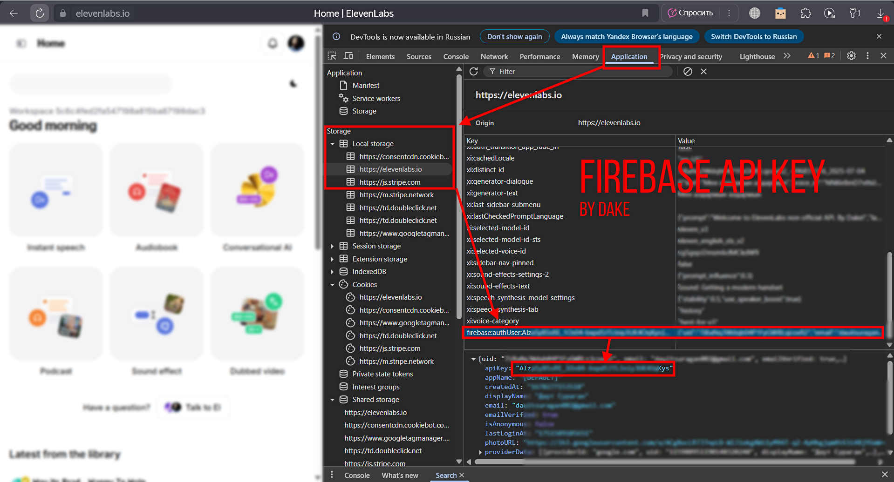

# ElevenLabs TTS V3 (method - 1)

This method uses your ElevenLabs **email and password** to authenticate via Firebase and retrieve a Bearer token.  
It provides full access to the restricted **`eleven_v3`** voices using the **official API endpoint**.

---

## ✅ Features

- ✅ Official API access via Firebase authentication
- ✅ No need to simulate browser behavior
- ✅ Works reliably with `eleven_v3` model
- ✅ Supports long-form text and multiple voices
- ⚠️ Requires login and Firebase API key

---

## 🔐 .env Configuration

Create a `.env` file inside `method_1/` directory with the following content:

```

ELEVENLABS_EMAIL=your_email
ELEVENLABS_PASSWORD=your_password
FIREBASE_API_KEY=apiKey

```

---

## 📎 How to get the Firebase API key

1. Visit [https://elevenlabs.io](https://elevenlabs.io) and open **Developer Tools**  
2. Go to the **Application** tab and refresh the page  
3. Storage
4. https://elevenlabs.io/
4. firebase:authUser:
5. Copy the `apiKey: "AIz-------------------Lys"`

**Example:**

<p align="center">
  
</p>

---

## 🧪 How it works

This script authenticates using Firebase's `signInWithPassword` endpoint  
and uses the returned `idToken` as a Bearer token to send requests to:

```

[https://api.us.elevenlabs.io/v1/text-to-dialogue/stream](https://api.us.elevenlabs.io/v1/text-to-dialogue/stream)

```

No browser emulation or Playwright needed.

---

## Credit

- [t.me/david667s](https://t.me/david667s)  
- Gemini  
- GPT  

---